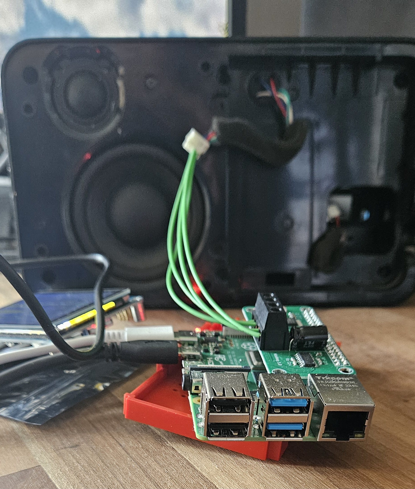

# squeezelite inside a squeezebox...

- rpi zero2 w
- picoreplayer

- install hifiberry dac (reboot etc etc)

- tce install ladspa
- tce install compiletc
- wget ADCf
- make it
- make install

- edit /opt/.filelist - adding usr/local/lib/ladspa/ACDf.so
- backup

- use asound.conf (replacing with /usr/local/lib/ladspa)

- set squeezelite output device to "makemono"
- 

Kernel cmdline (m1/c1/vicmd)
video=HDMI-A-1:480x640,rotate=270

